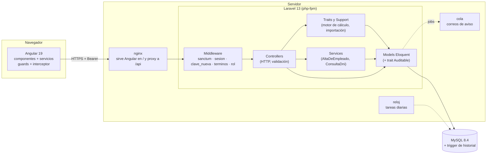
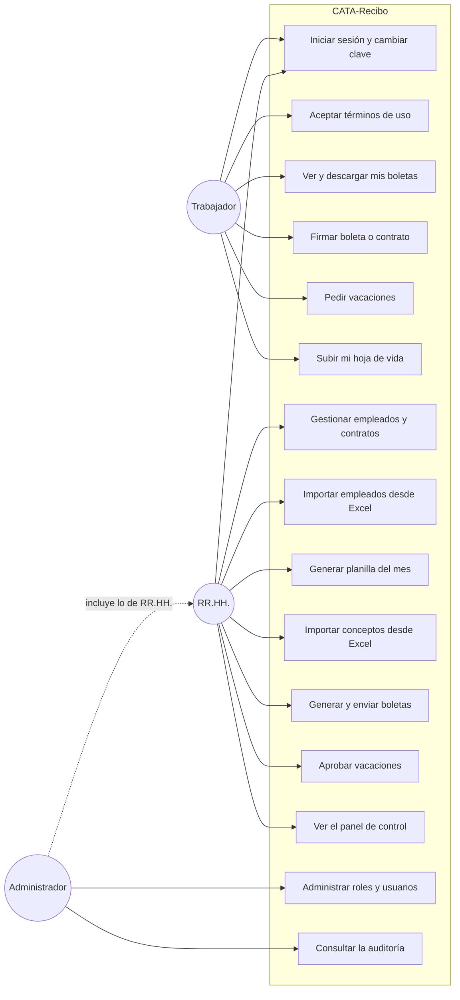
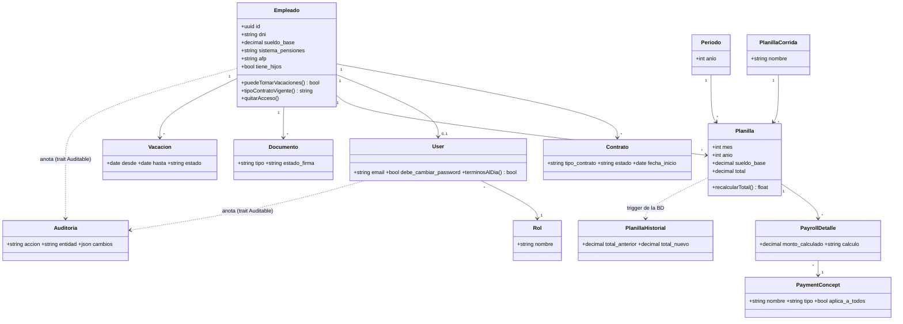
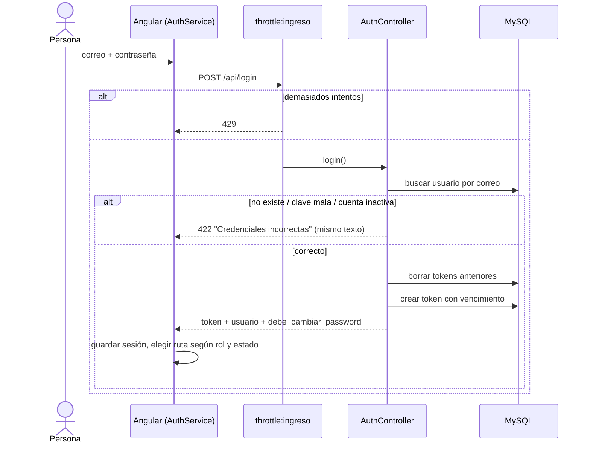
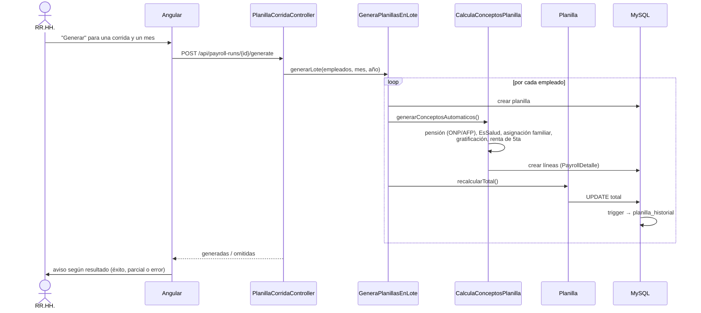
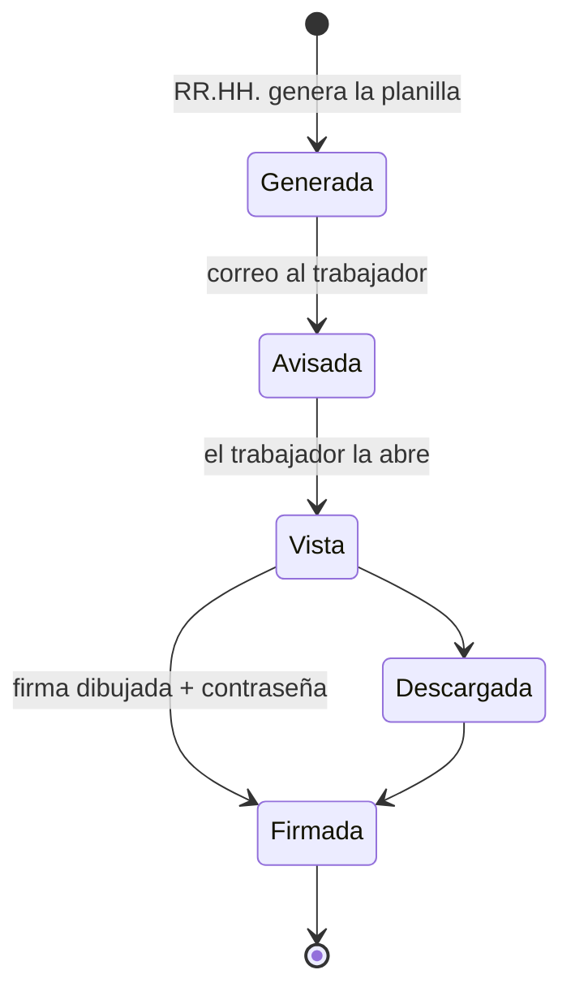
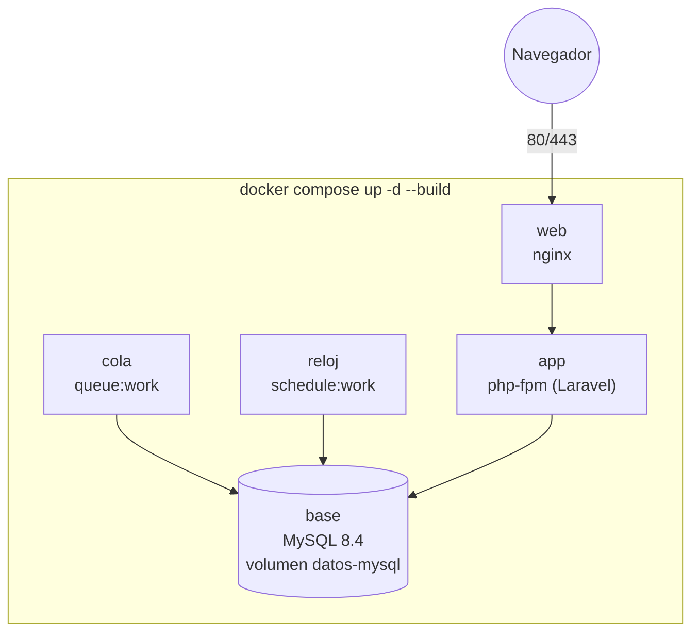

# Arquitectura y UML — CATA-Recibo

Complementa a [MODELO-DE-DATOS.md](MODELO-DE-DATOS.md) (el modelo entidad-relación,
que se genera desde las migraciones). Aquí está el resto del modelado: quién usa
el sistema, cómo está armado por dentro y cómo se conversan sus piezas.

Los diagramas están en Mermaid: GitHub y VS Code los dibujan directamente.

---

## 1. Arquitectura general

Cliente-servidor en capas. El navegador nunca toca la base: todo pasa por el API.

### Patrones que usa el proyecto

| Patrón | Dónde | Para qué |
|---|---|---|
| **MVC** | Laravel: `Models` / `Controllers` / JSON como vista | Separar datos, lógica HTTP y presentación |
| **Service layer** | `app/Services` | Reglas que varios controladores comparten (alta de empleado) |
| **Trait (composición)** | `CalculaConceptosPlanilla`, `GeneraPlanillasEnLote`, `Auditable`, `ListadoPaginado` | Reutilizar comportamiento sin herencia profunda |
| **Observer** | eventos de modelo en `Auditable` (`created`/`updated`/`deleted`) | La auditoría se anota sola, sin tocar cada controlador |
| **Middleware / Chain of Responsibility** | `rol`, `terminos`, `clave_nueva`, `sesion` | Cada capa decide si la petición sigue |
| **Interceptor** | `auth.interceptor.ts` | Token, verbos, 401/423/428 en un solo sitio |
| **Guard** | `auth.guard.ts` | Proteger rutas del frontend por sesión y por rol |
| **Componentes compartidos** | `data-table`, `form-modal`, `wizard` | Una sola tabla y un solo modal para todas las pantallas |
| **Single source of truth** | `ConceptosDePago`, `Meses` | El nombre de un concepto vive en un solo archivo |

---

## 2. Casos de uso

---

## 3. Clases del dominio

Solo las clases del negocio y sus relaciones (las columnas completas están en el
modelo de datos).

---

## 4. Secuencia: iniciar sesión

Es la puerta abierta a internet, por eso los tres rechazos contestan igual y
gastan el mismo tiempo (OWASP: no enumerar usuarios).

## 5. Secuencia: generar la planilla de un mes

## 6. Estados de una boleta

## 7. Despliegue

Las tres piezas de PHP salen de la **misma imagen**, así que no pueden quedar
desincronizadas entre ellas. Detalle en [DESPLIEGUE.md](../DESPLIEGUE.md).
