# Casos de uso y diagramas de secuencia — CATA-Recibo

Un caso de uso y un diagrama de secuencia por cada proceso del sistema. Los
diagramas están en [Mermaid](https://mermaid.js.org/): GitHub los dibuja solo
al abrir este archivo.

Las rutas y reglas salen del código (`CR-Backend/routes/api.php` y los
controladores). Complementa a [ARQUITECTURA-Y-UML.md](ARQUITECTURA-Y-UML.md),
que trae la arquitectura, las clases y el diagrama general de casos de uso.

## Índice

| # | Proceso | Actor principal |
|---|---------|-----------------|
| 1 | [Iniciar sesión](#1-iniciar-sesión) | Cualquier usuario |
| 2 | [Recuperar la contraseña](#2-recuperar-la-contraseña) | Cualquier usuario |
| 3 | [Aceptar los términos de uso](#3-aceptar-los-términos-de-uso) | Trabajador |
| 4 | [Dar de alta a un empleado](#4-dar-de-alta-a-un-empleado) | RR.HH. |
| 5 | [Importar empleados desde Excel](#5-importar-empleados-desde-excel) | RR.HH. |
| 6 | [Generar la planilla del mes](#6-generar-la-planilla-del-mes) | RR.HH. |
| 7 | [Importar conceptos desde Excel y aplicarlos a un grupo](#7-importar-conceptos-desde-excel-y-aplicarlos-a-un-grupo) | RR.HH. |
| 8 | [Emitir las boletas](#8-emitir-las-boletas) | RR.HH. |
| 9 | [Ver, descargar y firmar una boleta](#9-ver-descargar-y-firmar-una-boleta) | Trabajador |
| 10 | [Pedir y aprobar vacaciones](#10-pedir-y-aprobar-vacaciones) | Trabajador / RR.HH. |
| 11 | [Expediente: hoja de vida y documentos anteriores](#11-expediente-hoja-de-vida-y-documentos-anteriores) | Trabajador / RR.HH. |
| 12 | [Aviso automático de planilla pendiente](#12-aviso-automático-de-planilla-pendiente) | Sistema |
| 13 | [Administración: roles, módulos, valores legales y auditoría](#13-administración-roles-módulos-valores-legales-y-auditoría) | Administrador |

## Actores

| Actor | Quién es | Qué puede |
|-------|----------|-----------|
| **Trabajador** | Rol `empleado` | Lo suyo: boletas, documentos, vacaciones, perfil |
| **RR.HH.** | Rol `rrhh` | Todo lo de personal y planilla, el panel de control |
| **Administrador** | Rol `admin` | Lo de RR.HH. más roles, módulos, valores legales y auditoría |
| **Sistema** | Tareas programadas | Avisos y limpieza, sin que nadie las pida |

Todas las rutas, salvo el inicio de sesión y la recuperación de clave, pasan
por los filtros `auth:sanctum → sesion → clave_nueva → terminos`: sin sesión
vigente, sin haber cambiado la clave provisional o sin haber aceptado los
términos no se llega a ninguna pantalla.

## Casos de uso por actor

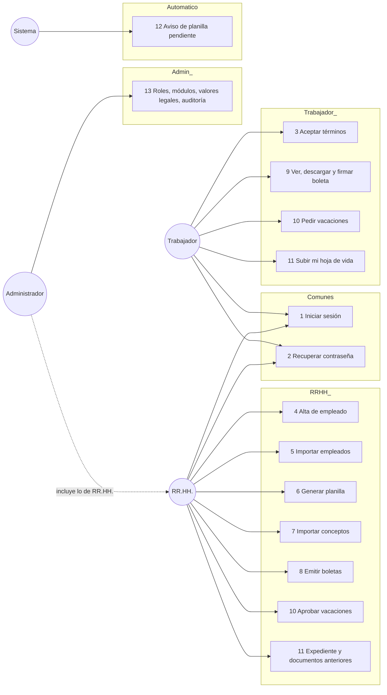

---

## 1. Iniciar sesión

| | |
|---|---|
| **Actor** | Cualquier usuario con cuenta |
| **Precondición** | La cuenta existe y está activa. No hay registro público: las cuentas las crea RR.HH. |
| **Ruta** | `POST /api/login` (limitada por `throttle:ingreso`) |
| **Flujo principal** | 1. Escribe correo y contraseña. 2. El sistema valida. 3. Entrega un token con vencimiento. 4. La pantalla elige la ruta según el rol y el estado de la cuenta. |
| **Flujos alternos** | Demasiados intentos → 429. Correo inexistente, contraseña mala o cuenta inactiva → el mismo 422 «Credenciales incorrectas», y tarda lo mismo (no se puede averiguar qué correos existen). Clave provisional (el DNI) → obligado a cambiarla antes de seguir. Términos sin aceptar → obligado a aceptarlos. |
| **Postcondición** | Sesión abierta; los tokens anteriores de esa cuenta quedan borrados. |

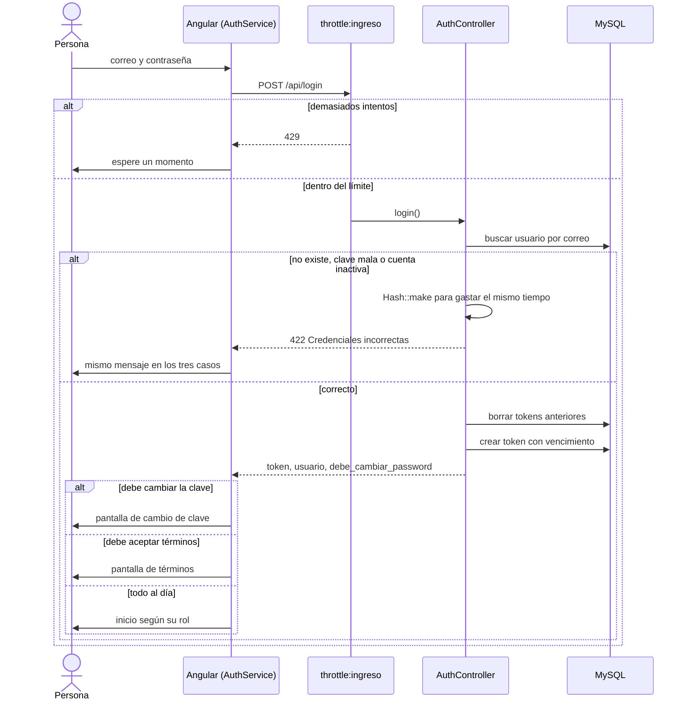

## 2. Recuperar la contraseña

| | |
|---|---|
| **Actor** | Cualquier usuario que olvidó la clave |
| **Precondición** | Tiene acceso a su correo |
| **Rutas** | `POST /api/forgot-password`, `POST /api/reset-password` (limitadas por `throttle:recuperacion`) |
| **Flujo principal** | 1. Escribe su correo. 2. El sistema contesta lo mismo exista o no. 3. Si existe, llega un correo con enlace. 4. Abre el enlace y escribe la clave nueva. 5. El sistema la guarda. |
| **Flujos alternos** | Pidió otro enlace demasiado pronto → se le avisa (es el único caso que se dice, para que no espere un correo que no saldrá). Token vencido o inválido → rechazo. |
| **Postcondición** | Clave nueva; **todas** las sesiones abiertas de esa cuenta se cierran. |

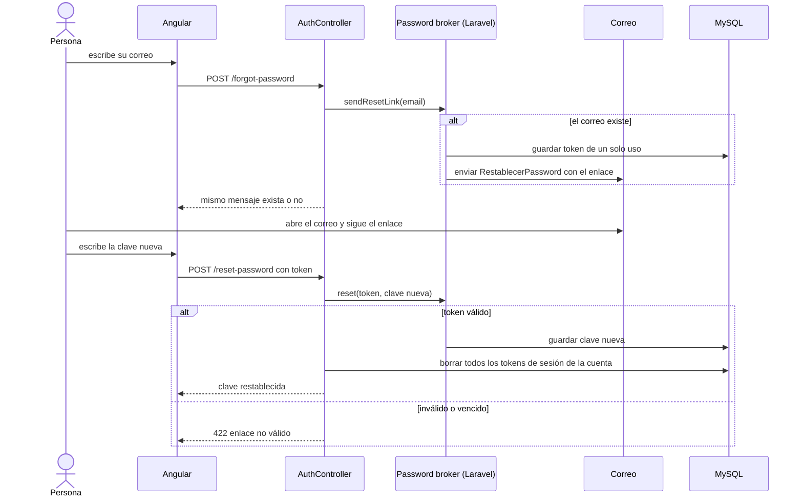

## 3. Aceptar los términos de uso

Reemplaza a la hoja impresa en la que cada trabajador firmaba que aceptaba
recibir sus boletas por medios digitales.

| | |
|---|---|
| **Actor** | Trabajador (y cualquier usuario con sesión) |
| **Precondición** | Sesión abierta y términos sin aceptar, o aceptada una versión anterior |
| **Rutas** | `GET /api/terms`, `POST /api/terms/accept` |
| **Flujo principal** | 1. El sistema le muestra el documento vigente. 2. Marca que acepta y confirma. 3. Se guarda quién, cuándo, qué versión y desde dónde. |
| **Flujos alternos** | Sin el «sí» explícito no se guarda. Si hay una versión nueva del documento, debe aceptarla de nuevo. |
| **Postcondición** | RR.HH. ve quién firmó y quién no, sin perseguir a nadie. |

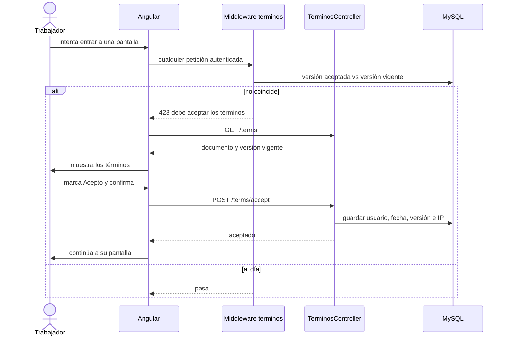

## 4. Dar de alta a un empleado

| | |
|---|---|
| **Actor** | RR.HH. |
| **Precondición** | Rol `rrhh` o `admin` |
| **Ruta** | `POST /api/employees` (la lógica vive en `AltaDeEmpleado`, compartida con la importación) |
| **Flujo principal** | 1. Escribe el DNI y pulsa consultar. 2. El sistema trae los nombres del padrón. 3. Completa cargo, área, sede, tipo de contrato, sueldo y datos de AFP u ONP. 4. Guarda. 5. El sistema crea la ficha, la cuenta con el DNI como clave provisional y el contrato inicial. |
| **Flujos alternos** | DNI de 8 cifras o carné de extranjería de 9. DNI ya registrado → rechazo. CUSPP de 12 caracteres, CCI de 20 dígitos. Un contrato que exige fecha de fin sin ella → rechazo. Si falla cualquier paso no queda nada a medias (transacción). |
| **Postcondición** | Empleado + usuario con rol `empleado` + contrato inicial, y el movimiento anotado en Auditoría. |

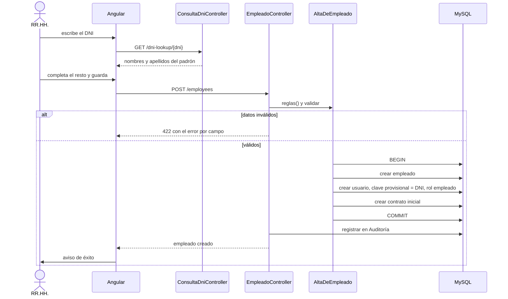

## 5. Importar empleados desde Excel

El archivo **no sale del navegador**: se lee allí y solo viajan las filas.
Detalle del flujo en `docs/importacion-empleados-secuencia.mmd`.

| | |
|---|---|
| **Actor** | RR.HH. |
| **Precondición** | Tiene el Excel llenado (puede bajar el modelo en `GET /employee-import/template`) |
| **Rutas** | `/employee-import/recognize`, `/preview`, `/apply`, `/resume` |
| **Flujo principal** | 1. Sube el Excel. 2. El sistema reconoce qué campo es cada columna y RR.HH. confirma. 3. Previsualiza: por cada fila busca el DNI y decide ALTA (no existe) o CAMBIO (existe). 4. Si no hay errores, aplica. 5. Se suben las hojas de vida en lote, emparejadas por DNI. |
| **Flujos alternos** | Hay errores en la previsualización → corrige el Excel y repite. Celda vacía = no tocar el dato actual. Falla algo al aplicar → se deshace todo (todo o nada). |
| **Postcondición** | Altas y cambios hechos y anotados en Auditoría. |

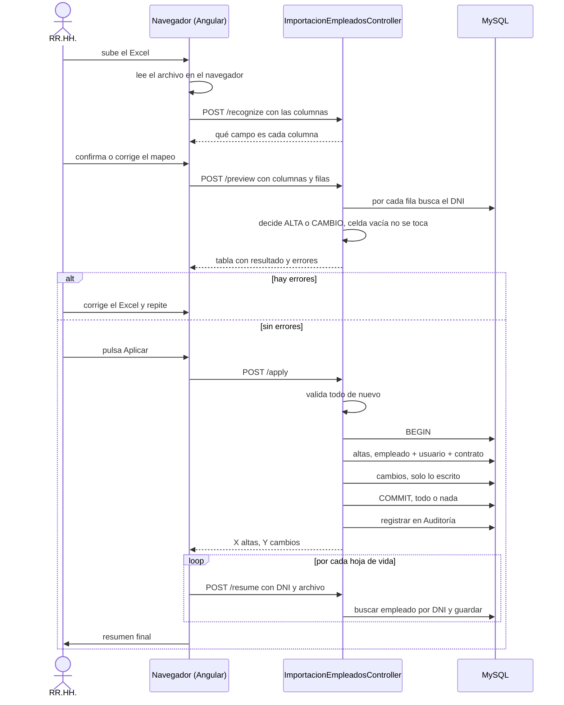

## 6. Generar la planilla del mes

| | |
|---|---|
| **Actor** | RR.HH. |
| **Precondición** | Existe una corrida de planilla (grupo de empleados) y los valores legales del año (UIT, asignación familiar, % de pensión, EsSalud) |
| **Rutas** | `POST /api/payroll-runs/{id}/generate`, o `POST /api/periods/{id}/generate-payroll` |
| **Flujo principal** | 1. Elige la corrida, el mes y el año y pulsa Generar. 2. Por cada empleado se crea su planilla. 3. Se calculan los conceptos automáticos: pensión (ONP o AFP), EsSalud, asignación familiar, gratificación y renta de 5ª categoría. 4. Se suma el total. |
| **Flujos alternos** | El empleado ya tiene planilla de ese mes → se omite. Resultado parcial → el aviso dice cuántas se generaron y cuántas se omitieron. |
| **Postcondición** | Una planilla por empleado con sus líneas; cada cambio de total queda en `planilla_historial` por un trigger. |

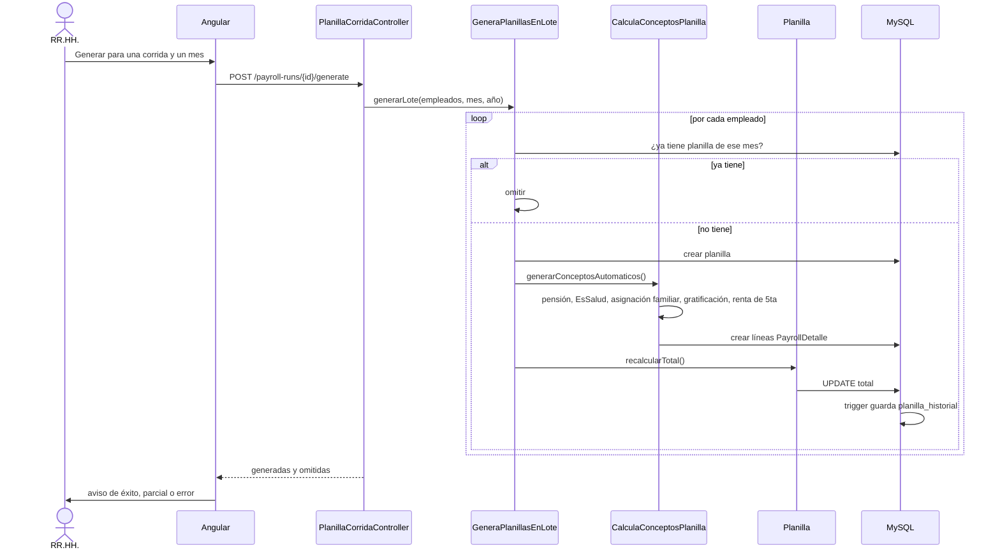

## 7. Importar conceptos desde Excel y aplicarlos a un grupo

Para los montos que no son automáticos: bonos, descuentos, comisiones, horas
extra. Hay dos niveles: por lote desde Excel y por grupo desde el catálogo.

| | |
|---|---|
| **Actor** | RR.HH. |
| **Precondición** | Planilla del mes ya generada (proceso 6) |
| **Rutas** | `/concept-import/recognize`, `/preview`, `/apply`; `POST /payment-concepts/{id}/apply-to-group`; `POST /payrolls/{id}/concepts`; `PUT /payrolls/{id}/recalcular` |
| **Flujo principal** | 1. Sube el Excel. 2. El sistema reconoce las columnas (recuerda los alias ya confirmados). 3. Previsualiza qué se aplicará a quién. 4. Aplica. 5. Se recalcula el total de cada planilla tocada. |
| **Flujos alternos** | Celda vacía = no tocar. Concepto desconocido → se pide asignarlo a uno del catálogo y se recuerda el alias. Para aplicar un mismo concepto a una lista de empleados, `apply-to-group` usa el cálculo y valor del catálogo. |
| **Postcondición** | Líneas creadas o actualizadas y totales al día, anotado en Auditoría. |

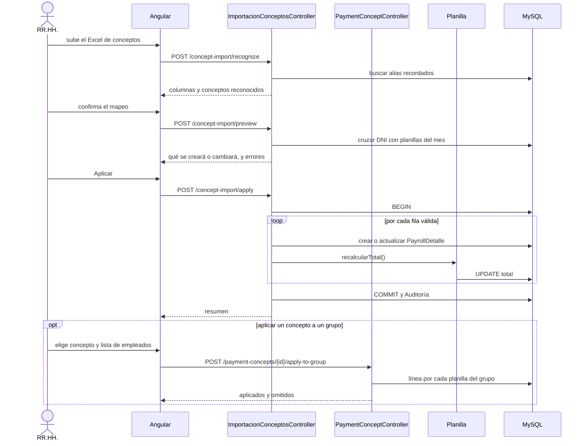

## 8. Emitir las boletas

| | |
|---|---|
| **Actor** | RR.HH. |
| **Precondición** | Planilla del mes generada y revisada |
| **Rutas** | `GET /api/payslips/{employee_id}/{month}/{year}` (una), `POST /api/payslips/generate-bulk` (todas, o solo las de una planilla) |
| **Flujo principal** | 1. Pulsa Emitir boletas. 2. Por cada planilla se arma el PDF y se guarda una copia en disco privado. 3. Se registra el Documento. 4. Se crea el aviso en la campana del trabajador y se encola el correo. |
| **Flujos alternos** | Boleta ya emitida → no se vuelve a generar (idempotente). Si ya está firmada, el PDF queda congelado. Corregir una boleta emitida exige la clave de RR.HH. (`POST /verify-password`) y no manda un segundo aviso. Boletas de un año anterior son de registro: no avisan. |
| **Postcondición** | Un Documento tipo `boleta` por planilla, con la fecha y el correo del aviso anotados. |

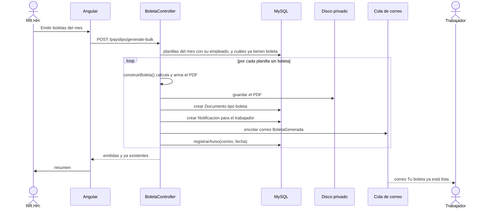

## 9. Ver, descargar y firmar una boleta

La firma es la firma dibujada del trabajador en pantalla más su contraseña.

| | |
|---|---|
| **Actor** | Trabajador |
| **Precondición** | Boleta emitida (proceso 8); el trabajador tiene su firma registrada (`POST /my-signature`) |
| **Rutas** | `GET /my-documents`, `PATCH /my-documents/{id}/viewed`, `GET /documents/{id}/download`, `POST /my-documents/{id}/sign` |
| **Flujo principal** | 1. Ve el aviso en la campana. 2. Abre la boleta (queda «vista»). 3. La descarga si quiere. 4. Pulsa Firmar y escribe su contraseña. 5. El sistema marca el documento firmado con un código de verificación y regenera el PDF con el sello. |
| **Flujos alternos** | Contraseña incorrecta → hasta 3 intentos; al tercero se cierra la sesión. Ya firmado → rechazo. Boleta «en papel» (de registro, anterior al sistema) → no se firma. Un tipo de documento que no se firma → rechazo (se revisa en el servidor, no solo escondiendo el botón). |
| **Postcondición** | `estado_firma = firmado`, con fecha, nombre y código. |

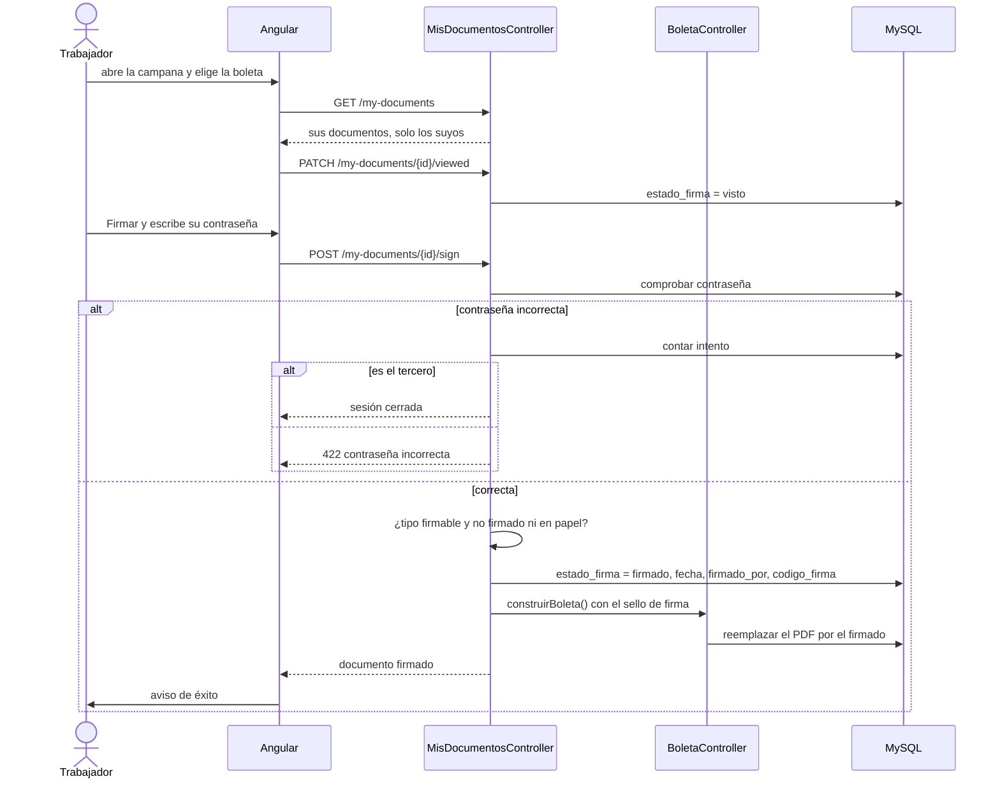

Estados de la boleta: ver [ARQUITECTURA-Y-UML.md §6](ARQUITECTURA-Y-UML.md).

## 10. Pedir y aprobar vacaciones

Regla del colegio: solo el personal con contrato **indeterminado** tiene
vacaciones; los otros contratos cobran Vacaciones Truncas.

| | |
|---|---|
| **Actor** | Trabajador (pide) y RR.HH. (resuelve) |
| **Precondición** | Su contrato da derecho a descanso |
| **Rutas** | `GET /vacations/balance`, `POST /vacations`, `PUT /vacations/{id}`, `DELETE /vacations/{id}` |
| **Flujo principal** | 1. El trabajador consulta su saldo. 2. Pide fechas de inicio y fin (días de calendario, ambos extremos incluidos). 3. Queda `pendiente`. 4. RR.HH. la aprueba o la rechaza. 5. Queda anotado quién resolvió y cuándo. |
| **Flujos alternos** | Contrato sin derecho → rechazo al pedir y otra vez al aprobar. Fechas que se cruzan con otra solicitud → rechazo. Se pasa del saldo al aprobar (por otras ya aprobadas) → rechazo. El trabajador solo retira la suya y mientras esté pendiente; RR.HH. retira cualquiera. |
| **Postcondición** | Solicitud aprobada o rechazada con `aprobado_por` y `aprobado_at` tomados del token, nunca del cliente. |

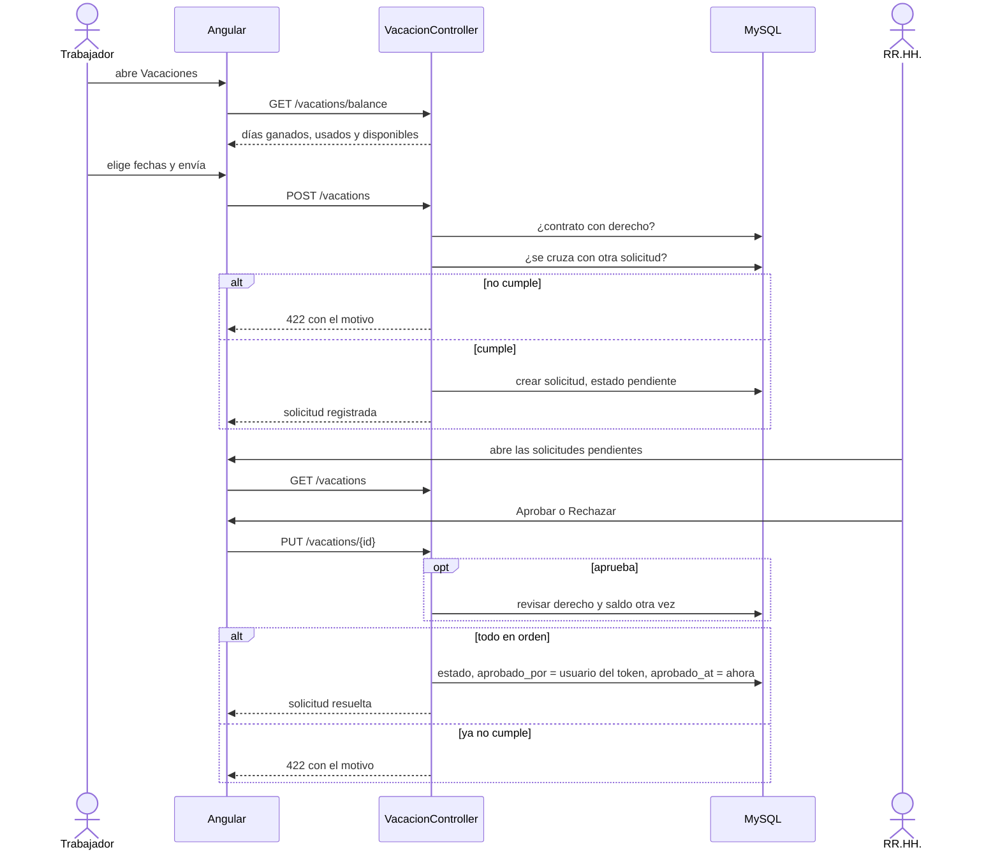

## 11. Expediente: hoja de vida y documentos anteriores

«Documentos» es el expediente digital de cada trabajador: hoja de vida,
contratos y boletas.

| | |
|---|---|
| **Actor** | Trabajador (su propio CV) y RR.HH. (expediente de todos y PDFs de antes del sistema) |
| **Precondición** | El empleado existe |
| **Rutas** | `POST /my-documents/resume`; `GET /employee-files` y `/employee-files/{id}`; `POST /legacy-documents/preview` y `POST /legacy-documents` |
| **Flujo principal (CV)** | 1. El trabajador sube su hoja de vida. 2. El sistema la guarda en su expediente y da de baja la anterior. |
| **Flujo principal (RR.HH.)** | 1. Abre el expediente y ve qué falta (sin hoja de vida, boletas por firmar, contratos por vencer). 2. Sube en lote los PDF de antes del sistema. 3. El sistema lee el DNI del PDF y lo empareja con el trabajador. 4. Previsualiza. 5. Confirma y se guardan como `boleta_anterior` o `contrato_anterior`. |
| **Flujos alternos** | El empleado sale del token, nunca del cuerpo de la petición (nadie puede colgarle un archivo al expediente de otro). PDF sin DNI legible o con DNI desconocido → queda marcado para corregir. Tipo o periodo no válido → rechazo con motivo. |
| **Postcondición** | Documentos en el expediente del trabajador, con su estado de firma (los de registro quedan «en papel»). |

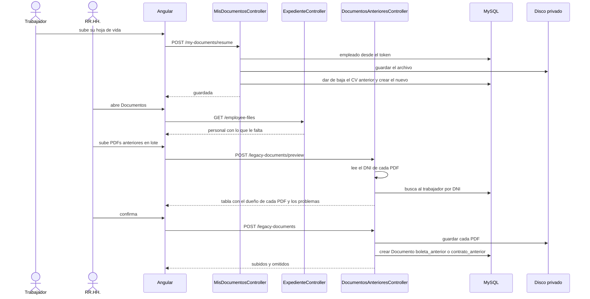

## 12. Aviso automático de planilla pendiente

| | |
|---|---|
| **Actor** | Sistema (programador de tareas de Laravel) |
| **Precondición** | El `schedule:run` corre cada minuto en el servidor |
| **Tarea** | `planillas:avisar-pendientes`, todos los días a las 08:00 |
| **Flujo principal** | 1. El penúltimo día del mes el sistema revisa si falta generar la planilla o emitir las boletas. 2. Si falta algo, deja un aviso en la campana de RR.HH. y Administración. |
| **Flujos alternos** | Cualquier otro día, o si todo está hecho → no avisa. Se programa a las 8 y no a medianoche para que el aviso ya esté cuando llegan a trabajar. |
| **Tarea de limpieza** | `sanctum:prune-expired --hours=48`, a diario: borra los tokens sin uso en 48 horas. |

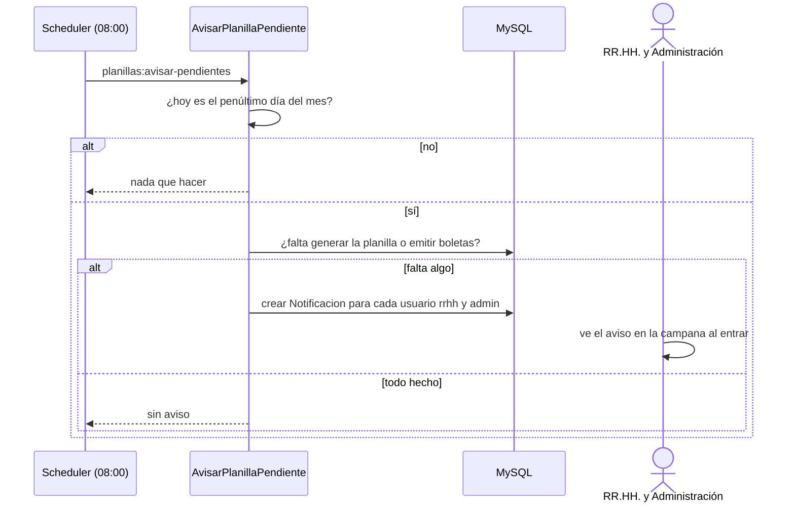

## 13. Administración: roles, módulos, valores legales y auditoría

| | |
|---|---|
| **Actor** | Administrador |
| **Precondición** | Rol `admin` (las rutas lo exigen con `rol:admin`) |
| **Rutas** | `/roles`, `/module-groups`, `/modules`, `POST /modules/{id}/roles`, `/legal-values`, `PUT /settings`, `GET /audit-log` |
| **Flujo principal** | 1. Administra qué módulos (menús) ve cada rol. 2. Carga los valores legales de cada año (UIT, asignación familiar, % de pensión y EsSalud) que usa el cálculo de la planilla. 3. Ajusta la configuración del sistema. 4. Consulta la auditoría: quién hizo qué y cuándo, con «Ver más» para el detalle completo de un registro. |
| **Flujos alternos** | Un RR.HH. que intente estas rutas recibe 403. Los cambios de menús llegan a cada usuario por `GET /my-modules` en su siguiente carga. |
| **Postcondición** | Cambios aplicados y registrados en Auditoría. |

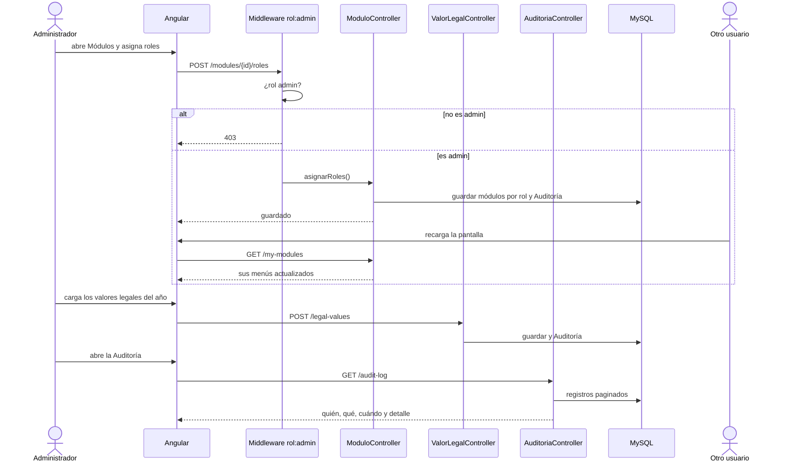
