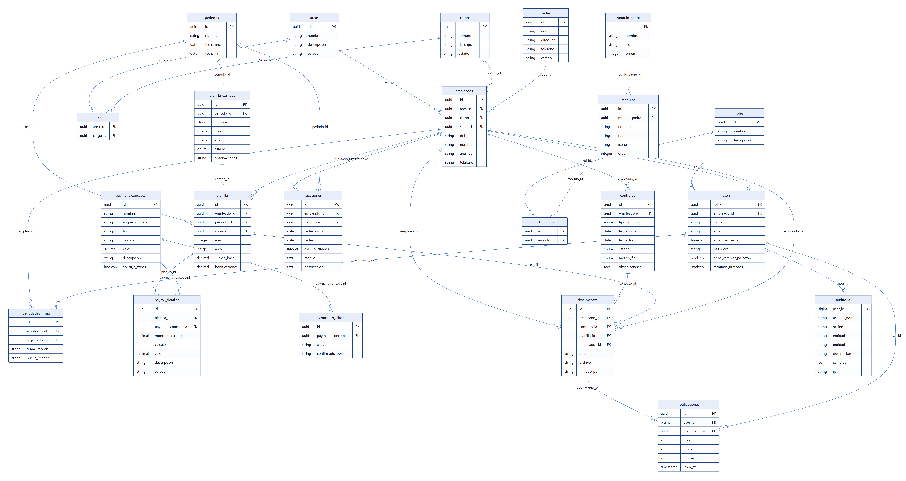
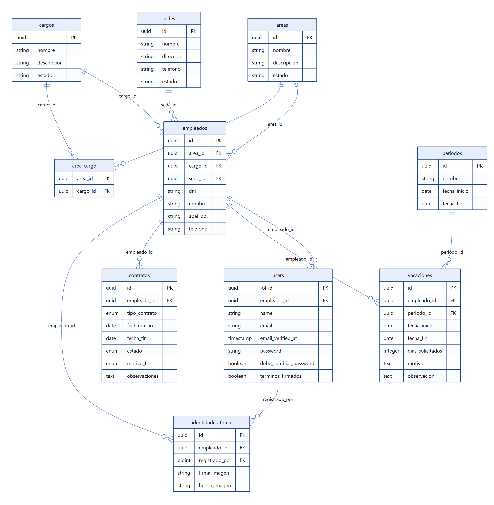
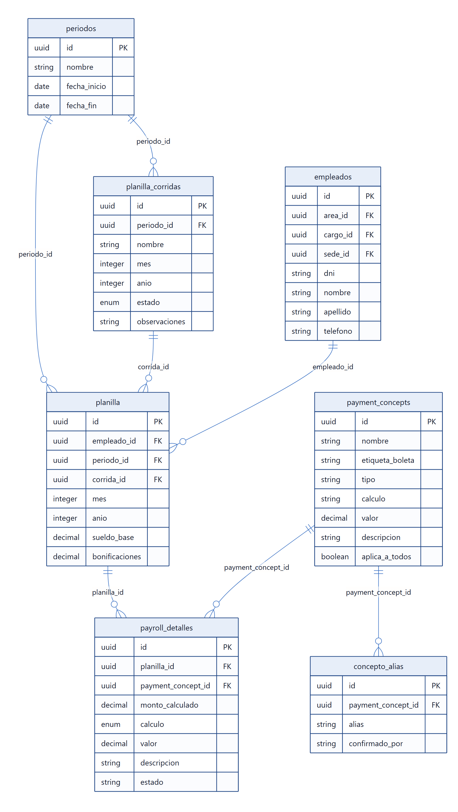
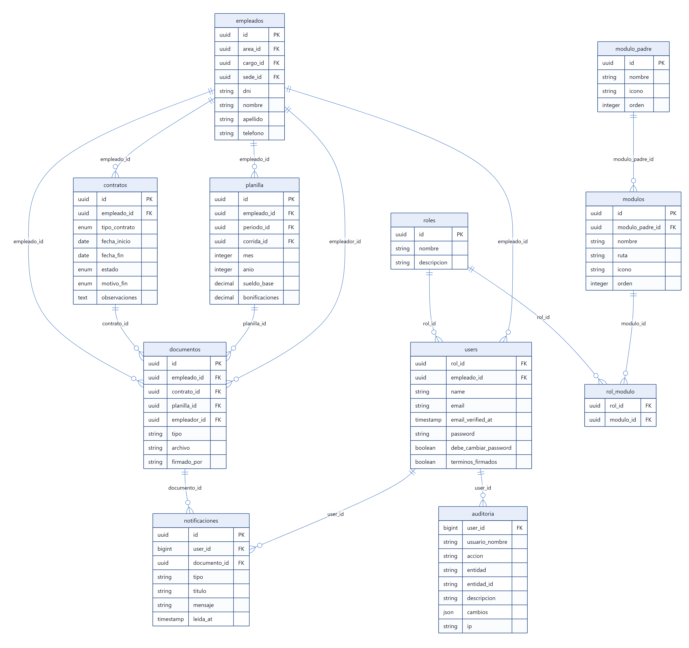

# Modelo de datos — CATA-Recibo

La base tiene **22 tablas del negocio** y **28 relaciones** entre ellas. Todo lo
que está en este documento sale de leer las migraciones del proyecto, así que
describe la base que se va a crear de verdad —no un dibujo hecho aparte que se
queda viejo a la primera semana—.

> Se generan con `python docs/herramientas/modelo-de-datos.py` y se dibujan con
> `node docs/herramientas/dibujar-modelo.js`. Cuando cambie una migración, se
> vuelven a correr y el modelo queda al día. Ver [cómo generarlo](#cómo-generar-el-gráfico).

Las ocho tablas que Laravel crea para su propio funcionamiento (`sessions`,
`cache`, `jobs`, `failed_jobs`, `password_reset_tokens`,
`personal_access_tokens`, `cache_locks`, `job_batches`) no entran al modelo:
son del framework, no del colegio.

---

## Cómo está organizado

| Grupo | Tablas | De qué trata |
|---|---|---|
| **Personal** | `empleados`, `contratos`, `identidades_firma`, `areas`, `cargos`, `sedes`, `area_cargo` | Quién trabaja en el colegio, con qué contrato y dónde |
| **Planilla** | `periodos`, `planilla_corridas`, `planilla`, `payroll_detalles`, `payment_concepts`, `concepto_alias` | Cuánto se le paga a cada quien cada mes y por qué conceptos |
| **Documentos** | `documentos`, `notificaciones` | Las boletas, los contratos firmados y el expediente de cada trabajador |
| **Vacaciones** | `vacaciones` | Las solicitudes y su aprobación |
| **Seguridad** | `users`, `roles`, `modulos`, `modulo_padre`, `rol_modulo`, `auditoria` | Quién entra, qué ve y qué cambió |

---

## El modelo completo



Con veintidós tablas juntas el dibujo se cruza bastante. Para leerlo con calma,
los tres diagramas por tema de abajo dicen lo mismo, separado.

### Personal



El centro es **`empleados`**. De ahí cuelga todo lo demás: sus contratos, su
firma, su cuenta de acceso y sus vacaciones. Las tres tablas de catálogo
—`areas`, `cargos` y `sedes`— existen para que esos datos no se escriban a mano
en cada ficha; `area_cargo` es la tabla puente que dice qué cargos son propios
de cada área (un cargo como "Docente" vale en varias).

### Planilla



Se lee de arriba abajo: un **periodo** (el mes de la campaña) agrupa **corridas**
(lo que se paga junto), cada corrida tiene una **planilla por trabajador**, y
cada planilla tiene sus **detalles**: una línea por concepto aplicado.

Ese último nivel es el que hace que la boleta se pueda explicar. Si un
trabajador pregunta por qué cobró menos, la respuesta está en sus líneas: qué
concepto, con qué cálculo y por cuánto.

### Documentos y seguridad



**`documentos`** es el expediente: la misma tabla guarda la boleta, el contrato
escaneado, la hoja de vida y los documentos anteriores al sistema, distinguidos
por su `tipo`. Cuando es una boleta, `planilla_id` dice de qué planilla salió;
cuando es un contrato firmado, `contrato_id` dice a cuál corresponde.

La firma vive en ese mismo registro: `estado_firma`, `fecha_firma` y
`codigo_firma` del lado del trabajador, y las cuatro columnas equivalentes del
lado del empleador.

---

## Las relaciones, una por una

La columna **"al borrar el padre"** es la parte que más se pasa por alto y la
que más daño hace: define qué ocurre con los hijos cuando se elimina el
registro del que dependen.


| Desde | Hacia | Cardinalidad | Al borrar el padre | Qué significa |
|---|---|---|---|---|
| `area_cargo.area_id` | `areas.id` | muchos a 1 | se borran con él | Qué cargos son propios de cada área. Un cargo puede valer en varias. |
| `empleados.area_id` | `areas.id` | muchos a 1 | queda en blanco | Cada trabajador pertenece a un área. Si el área se borra, la ficha queda sin área: no se pierde el trabajador. |
| `area_cargo.cargo_id` | `cargos.id` | muchos a 1 | se borran con él | El otro lado de esa misma relación. |
| `empleados.cargo_id` | `cargos.id` | muchos a 1 | queda en blanco | El puesto que ocupa. |
| `documentos.contrato_id` | `contratos.id` | muchos a 1 | queda en blanco | Si el documento es un contrato firmado, a cuál corresponde. |
| `notificaciones.documento_id` | `documentos.id` | muchos a 1 | queda en blanco | El aviso apunta a la boleta que llegó. |
| `contratos.empleado_id` | `empleados.id` | muchos a 1 | se borran con él | Los contratos de un trabajador. Si se borra la ficha, se van con ella. |
| `documentos.empleado_id` | `empleados.id` | muchos a 1 | se borran con él | El expediente de un trabajador. |
| `documentos.empleador_id` | `empleados.id` | muchos a 1 | queda en blanco | Quién firmó como empleador. |
| `identidades_firma.empleado_id` | `empleados.id` | muchos a 1 | se borran con él | Su firma y su huella, una sola por trabajador. |
| `users.empleado_id` | `empleados.id` | muchos a 1 | queda en blanco | La cuenta de acceso de un trabajador. Las cuentas de sistema (admin, RR.HH.) van sin ficha. |
| `vacaciones.empleado_id` | `empleados.id` | muchos a 1 | se borran con él | Las solicitudes de un trabajador. |
| `modulos.modulo_padre_id` | `modulo_padre.id` | muchos a 1 | se borran con él | De qué grupo del menú cuelga. |
| `rol_modulo.modulo_id` | `modulos.id` | muchos a 1 | se borran con él | El otro lado de esa misma relación. |
| `concepto_alias.payment_concept_id` | `payment_concepts.id` | muchos a 1 | se borran con él | Los nombres con que el colegio llama a ese concepto en sus Excel. |
| `payroll_detalles.payment_concept_id` | `payment_concepts.id` | muchos a 1 | **no deja borrar** | Qué concepto del catálogo se aplicó. Tampoco deja borrar un concepto en uso. |
| `planilla.periodo_id` | `periodos.id` | muchos a 1 | queda en blanco | La planilla se arma dentro de un periodo. |
| `planilla_corridas.periodo_id` | `periodos.id` | muchos a 1 | queda en blanco | La corrida pertenece a un periodo. |
| `vacaciones.periodo_id` | `periodos.id` | muchos a 1 | queda en blanco | El periodo sobre el que las pide. |
| `documentos.planilla_id` | `planilla.id` | muchos a 1 | queda en blanco | Si es una boleta, de qué planilla salió. |
| `payroll_detalles.planilla_id` | `planilla.id` | muchos a 1 | **no deja borrar** | Las líneas de una planilla. **No deja borrar** una planilla que tenga líneas. |
| `planilla.corrida_id` | `planilla_corridas.id` | muchos a 1 | queda en blanco | Las planillas que se pagan juntas comparten corrida. |
| `rol_modulo.rol_id` | `roles.id` | muchos a 1 | se borran con él | Qué módulos ve cada rol. |
| `users.rol_id` | `roles.id` | muchos a 1 | queda en blanco | Con qué rol entra: admin, rrhh o empleado. |
| `empleados.sede_id` | `sedes.id` | muchos a 1 | queda en blanco | El local donde trabaja. |
| `auditoria.user_id` | `users.id` | muchos a 1 | queda en blanco | Quién hizo el cambio. Si la cuenta se borra, el nombre queda escrito en la bitácora. |
| `identidades_firma.registrado_por` | `users.id` | muchos a 1 | queda en blanco | Qué cuenta la registró. |
| `notificaciones.user_id` | `users.id` | muchos a 1 | se borran con él | A qué cuenta le llega. |

### Relaciones que existen en el sistema pero no en la base

Hay una que conviene saber, porque el gráfico no la dibuja: **`planilla.empleado_id`
no tiene llave foránea**. La columna está y tiene su índice, el código la usa
(`Planilla::empleado()`), pero la base no la vigila.

En la práctica significa que, si alguien borrara un trabajador directamente con
una consulta SQL, sus planillas quedarían apuntando a una ficha que ya no
existe. Por la aplicación no puede pasar —dar de baja no borra a nadie, deja al
trabajador inactivo—, pero es una puerta abierta.

Se cierra con una migración de una línea:

```php
$table->foreign('empleado_id')->references('id')->on('empleados')->restrictOnDelete();
```

Antes de aplicarla hay que comprobar que no haya planillas huérfanas, o la
migración falla:

```sql
SELECT COUNT(*) FROM planilla p
LEFT JOIN empleados e ON e.id = p.empleado_id
WHERE e.id IS NULL;
```

---

## Decisiones de diseño

**Las llaves son UUID, no números correlativos.** Un `id` de 1, 2, 3 le dice a
cualquiera cuántos trabajadores hay y permite adivinar direcciones ajenas
(`/documentos/48`). Con UUID no se adivina nada. El costo es que ocupan más y
son incómodos de teclear; a cambio, dos instalaciones distintas pueden
fusionar datos sin chocar.

**Casi nada se borra.** Las tablas principales llevan `estado` o
`estado_registro`: dar de baja a un trabajador lo deja inactivo y desactiva su
cuenta, pero conserva su historial de planillas y boletas, que es justo lo que
la ley obliga a guardar.

**Los importes son `decimal(10,2)`, nunca decimales flotantes.** Un `float`
arrastra errores de redondeo —el clásico 0.1 + 0.2 que no da 0.3— y en una
planilla eso significa céntimos que no cuadran al sumar.

**El catálogo de conceptos es dato, no código.** Las tasas (ONP 13 %, EsSalud
9 %) viven en `payment_concepts`, no escritas dentro del programa: cuando una
cambie por norma, se corrige desde la pantalla de Conceptos de Pago y no hace
falta tocar el sistema.

**La auditoría solo crece.** `auditoria` no tiene pantalla de edición ni de
borrado, y guarda el nombre del usuario además de su id: si la cuenta se
elimina después, la bitácora sigue diciendo quién hizo el cambio.

---

## Diccionario de datos

Cada tabla con todos sus campos. Despliega la que te interese.


### Personal

<details>
<summary><b><code>empleados</code></b> — 30 campos · La ficha del trabajador: datos personales, laborales, de planilla y bancarios.</summary>

| Campo | Tipo | Notas |
|---|---|---|
| `id` | uuid | Llave primaria |
| `dni` | string | único |
| `nombre` | string |  |
| `apellido` | string |  |
| `area_id` | uuid | → `areas`, puede ir vacío |
| `cargo_id` | uuid | → `cargos`, puede ir vacío |
| `telefono` | string | puede ir vacío |
| `direccion` | string | puede ir vacío |
| `fecha_ingreso` | date |  |
| `estado` | string | por defecto activo |
| `sistema_pensiones` | enum(AFP,ONP,ONP) | puede ir vacío, por defecto ONP |
| `afp` | enum(Habitat,Integra,Prima,Profuturo) | puede ir vacío |
| `cuspp` | string | puede ir vacío |
| `entidad_financiera` | string | puede ir vacío |
| `numero_cuenta` | string | puede ir vacío |
| `tiene_hijos` | boolean | por defecto false |
| `sueldo_base` | decimal(10,2) | puede ir vacío |
| `tipo_contrato` | enum(indeterminado,plazo_fijo,suplencia,practicas) | puede ir vacío |
| `forma_pago` | enum(banco,efectivo,otro) | puede ir vacío |
| `sede_id` | uuid | → `sedes`, puede ir vacío |
| `nivel_estudios` | enum(primaria,secundaria,tecnico,universitario,maestria,doctorado) | puede ir vacío |
| `especialidad` | string | puede ir vacío |
| `institucion_estudios` | string | puede ir vacío |
| `contacto_emergencia_nombre` | string | puede ir vacío |
| `contacto_emergencia_telefono` | string | puede ir vacío |
| `fecha_nacimiento` | date | puede ir vacío |
| `created_at` | timestamp | puede ir vacío |
| `updated_at` | timestamp | puede ir vacío |
| `cci` | string | puede ir vacío |
| `fecha_cese` | date | puede ir vacío |

</details>

<details>
<summary><b><code>contratos</code></b> — 11 campos · El vinculo laboral. Un trabajador tiene un solo contrato vigente a la vez.</summary>

| Campo | Tipo | Notas |
|---|---|---|
| `id` | uuid | Llave primaria |
| `empleado_id` | uuid | → `empleados` |
| `tipo_contrato` | enum(indeterminado,plazo_fijo,suplencia,practicas) |  |
| `fecha_inicio` | date |  |
| `fecha_fin` | date | puede ir vacío |
| `estado` | enum(vigente,finalizado,renovado,vigente) | por defecto vigente |
| `motivo_fin` | enum(renuncia,despido,fin_contrato_plazo,fin_año_escolar,no_renovacion,jubilacion) | puede ir vacío |
| `observaciones` | text | puede ir vacío |
| `estado_registro` | string | por defecto activo |
| `created_at` | timestamp | puede ir vacío |
| `updated_at` | timestamp | puede ir vacío |

</details>

<details>
<summary><b><code>identidades_firma</code></b> — 7 campos · La firma y la huella del trabajador, para estampar en su boleta.</summary>

| Campo | Tipo | Notas |
|---|---|---|
| `id` | uuid | Llave primaria |
| `empleado_id` | uuid | → `empleados`, único |
| `firma_imagen` | string | puede ir vacío |
| `huella_imagen` | string | puede ir vacío |
| `registrado_por` | foreignId | → `users`, puede ir vacío |
| `created_at` | timestamp | puede ir vacío |
| `updated_at` | timestamp | puede ir vacío |

</details>

<details>
<summary><b><code>areas</code></b> — 6 campos · Areas academicas y administrativas del colegio.</summary>

| Campo | Tipo | Notas |
|---|---|---|
| `id` | uuid | Llave primaria |
| `nombre` | string | único |
| `descripcion` | string | puede ir vacío |
| `estado` | string | por defecto activo |
| `created_at` | timestamp | puede ir vacío |
| `updated_at` | timestamp | puede ir vacío |

</details>

<details>
<summary><b><code>cargos</code></b> — 6 campos · Puestos que puede ocupar un trabajador.</summary>

| Campo | Tipo | Notas |
|---|---|---|
| `id` | uuid | Llave primaria |
| `nombre` | string | único |
| `descripcion` | string | puede ir vacío |
| `estado` | string | por defecto activo |
| `created_at` | timestamp | puede ir vacío |
| `updated_at` | timestamp | puede ir vacío |

</details>

<details>
<summary><b><code>sedes</code></b> — 7 campos · Los locales del colegio.</summary>

| Campo | Tipo | Notas |
|---|---|---|
| `id` | uuid | Llave primaria |
| `nombre` | string | único |
| `direccion` | string | puede ir vacío |
| `telefono` | string | puede ir vacío |
| `estado` | string | por defecto activo |
| `created_at` | timestamp | puede ir vacío |
| `updated_at` | timestamp | puede ir vacío |

</details>

<details>
<summary><b><code>area_cargo</code></b> — 2 campos · Que cargos son propios de cada area. Un cargo puede valer en varias.</summary>

| Campo | Tipo | Notas |
|---|---|---|
| `id` | uuid | Llave primaria |
| `area_id` | uuid | → `areas` |
| `cargo_id` | uuid | → `cargos` |

</details>

### Planilla

<details>
<summary><b><code>periodos</code></b> — 6 campos · El tramo de la campana de planillas sobre el que se genera.</summary>

| Campo | Tipo | Notas |
|---|---|---|
| `id` | uuid | Llave primaria |
| `nombre` | string |  |
| `fecha_inicio` | date |  |
| `fecha_fin` | date |  |
| `created_at` | timestamp | puede ir vacío |
| `updated_at` | timestamp | puede ir vacío |

</details>

<details>
<summary><b><code>planilla_corridas</code></b> — 9 campos · Una corrida agrupa las planillas que se pagan juntas.</summary>

| Campo | Tipo | Notas |
|---|---|---|
| `id` | uuid | Llave primaria |
| `nombre` | string |  |
| `mes` | integer |  |
| `anio` | integer |  |
| `periodo_id` | uuid | → `periodos`, puede ir vacío |
| `estado` | enum(abierta,cerrada,abierta) | por defecto abierta |
| `observaciones` | string | puede ir vacío |
| `created_at` | timestamp | puede ir vacío |
| `updated_at` | timestamp | puede ir vacío |

</details>

<details>
<summary><b><code>planilla</code></b> — 13 campos · La planilla de UN trabajador en un mes: su base, sus sumas y su neto.</summary>

| Campo | Tipo | Notas |
|---|---|---|
| `id` | uuid | Llave primaria |
| `empleado_id` | uuid |  |
| `mes` | integer |  |
| `anio` | integer |  |
| `periodo_id` | uuid | → `periodos`, puede ir vacío |
| `corrida_id` | uuid | → `planilla_corridas`, puede ir vacío |
| `sueldo_base` | decimal(10,2) |  |
| `bonificaciones` | decimal(10,2) | por defecto 0 |
| `descuentos` | decimal(10,2) | por defecto 0 |
| `total` | decimal(10,2) |  |
| `estado_registro` | string | por defecto activo |
| `created_at` | timestamp | puede ir vacío |
| `updated_at` | timestamp | puede ir vacío |

</details>

<details>
<summary><b><code>payroll_detalles</code></b> — 10 campos · Cada linea de esa planilla: que concepto se aplico y por cuanto.</summary>

| Campo | Tipo | Notas |
|---|---|---|
| `id` | uuid | Llave primaria |
| `planilla_id` | uuid | → `planilla` |
| `payment_concept_id` | uuid | → `payment_concepts` |
| `monto_calculado` | decimal(10,2) |  |
| `calculo` | enum(fijo,porcentaje) | puede ir vacío |
| `valor` | decimal(10,2) | puede ir vacío |
| `descripcion` | string | puede ir vacío |
| `estado` | string | por defecto activo |
| `created_at` | timestamp | puede ir vacío |
| `updated_at` | timestamp | puede ir vacío |

</details>

<details>
<summary><b><code>payment_concepts</code></b> — 10 campos · El catalogo de bonificaciones, descuentos, aportaciones y adelantos.</summary>

| Campo | Tipo | Notas |
|---|---|---|
| `id` | uuid | Llave primaria |
| `nombre` | string | único |
| `etiqueta_boleta` | string | puede ir vacío |
| `tipo` | string |  |
| `calculo` | string | puede ir vacío |
| `valor` | decimal(10,2) | puede ir vacío |
| `descripcion` | string | puede ir vacío |
| `aplica_a_todos` | boolean | por defecto false |
| `created_at` | timestamp | puede ir vacío |
| `updated_at` | timestamp | puede ir vacío |

</details>

<details>
<summary><b><code>concepto_alias</code></b> — 6 campos · Los nombres con los que el colegio llama a un concepto en sus Excel.</summary>

| Campo | Tipo | Notas |
|---|---|---|
| `id` | uuid | Llave primaria |
| `alias` | string | único |
| `payment_concept_id` | uuid | → `payment_concepts` |
| `confirmado_por` | string | puede ir vacío |
| `created_at` | timestamp | puede ir vacío |
| `updated_at` | timestamp | puede ir vacío |

</details>

### Documentos y avisos

<details>
<summary><b><code>documentos</code></b> — 26 campos · El expediente: boletas, contratos firmados, hojas de vida y documentos anteriores.</summary>

| Campo | Tipo | Notas |
|---|---|---|
| `id` | uuid | Llave primaria |
| `empleado_id` | uuid | → `empleados` |
| `contrato_id` | uuid | → `contratos`, puede ir vacío |
| `tipo` | string |  |
| `archivo` | string |  |
| `firmado_por` | string | puede ir vacío |
| `codigo_firma` | string | puede ir vacío |
| `fecha_firma` | timestamp | puede ir vacío |
| `estado_firma` | enum(pendiente,visto,firmado,pendiente) | por defecto pendiente |
| `planilla_id` | uuid | → `planilla`, puede ir vacío |
| `fecha_visto` | timestamp | puede ir vacío |
| `fecha_aviso` | timestamp | puede ir vacío |
| `aviso_correo` | string | puede ir vacío |
| `fecha_descarga` | timestamp | puede ir vacío |
| `descargas` | unsignedInteger | por defecto 0 |
| `empleador_id` | uuid | → `empleados`, puede ir vacío |
| `firmado_por_empleador` | string | puede ir vacío |
| `codigo_firma_empleador` | string | puede ir vacío |
| `fecha_firma_empleador` | timestamp | puede ir vacío |
| `estado_firma_empleador` | enum(pendiente,firmado,pendiente) | por defecto pendiente |
| `estado_registro` | string | por defecto activo |
| `created_at` | timestamp | puede ir vacío |
| `updated_at` | timestamp | puede ir vacío |
| `periodo_mes` | unsignedTinyInteger | puede ir vacío |
| `periodo_anio` | unsignedSmallInteger | puede ir vacío |
| `huella` | char | puede ir vacío |

</details>

<details>
<summary><b><code>notificaciones</code></b> — 9 campos · Los avisos del trabajador (la campana).</summary>

| Campo | Tipo | Notas |
|---|---|---|
| `id` | uuid | Llave primaria |
| `user_id` | foreignId | → `users` |
| `tipo` | string | por defecto boleta_disponible |
| `titulo` | string |  |
| `mensaje` | string |  |
| `documento_id` | uuid | → `documentos`, puede ir vacío |
| `leida_at` | timestamp | puede ir vacío |
| `created_at` | timestamp | puede ir vacío |
| `updated_at` | timestamp | puede ir vacío |

</details>

### Vacaciones

<details>
<summary><b><code>vacaciones</code></b> — 14 campos · Solicitud de vacaciones, su estado y quien la respondio.</summary>

| Campo | Tipo | Notas |
|---|---|---|
| `id` | uuid | Llave primaria |
| `empleado_id` | uuid | → `empleados` |
| `periodo_id` | uuid | → `periodos`, puede ir vacío |
| `fecha_inicio` | date |  |
| `fecha_fin` | date |  |
| `dias_solicitados` | integer |  |
| `motivo` | text | puede ir vacío |
| `observacion` | text | puede ir vacío |
| `estado` | string | por defecto pendiente |
| `aprobado_por` | string | puede ir vacío |
| `aprobado_at` | timestamp | puede ir vacío |
| `estado_registro` | string | por defecto activo |
| `created_at` | timestamp | puede ir vacío |
| `updated_at` | timestamp | puede ir vacío |

</details>

### Seguridad y accesos

<details>
<summary><b><code>users</code></b> — 15 campos · La cuenta de acceso. Puede estar atada a un trabajador o ser solo del sistema.</summary>

| Campo | Tipo | Notas |
|---|---|---|
| `id` | uuid | Llave primaria |
| `name` | string |  |
| `email` | string | único |
| `email_verified_at` | timestamp | puede ir vacío |
| `password` | string |  |
| `debe_cambiar_password` | boolean | por defecto false |
| `terminos_firmados` | boolean | por defecto false |
| `terminos_firmados_en` | timestamp | puede ir vacío |
| `terminos_version` | string | puede ir vacío |
| `terminos_ip` | string | puede ir vacío |
| `created_at` | timestamp | puede ir vacío |
| `updated_at` | timestamp | puede ir vacío |
| `rol_id` | uuid | → `roles`, puede ir vacío |
| `empleado_id` | uuid | → `empleados`, puede ir vacío |
| `estado_registro` | string | por defecto activo |
| `foto` | string | puede ir vacío |

</details>

<details>
<summary><b><code>roles</code></b> — 5 campos · admin, rrhh y empleado: la llave con la que el backend decide que se puede hacer.</summary>

| Campo | Tipo | Notas |
|---|---|---|
| `id` | uuid | Llave primaria |
| `nombre` | string | único |
| `descripcion` | string | puede ir vacío |
| `created_at` | timestamp | puede ir vacío |
| `updated_at` | timestamp | puede ir vacío |

</details>

<details>
<summary><b><code>modulo_padre</code></b> — 7 campos · Los grupos de la barra lateral.</summary>

| Campo | Tipo | Notas |
|---|---|---|
| `id` | uuid | Llave primaria |
| `nombre` | string |  |
| `icono` | string | puede ir vacío |
| `orden` | integer | por defecto 0 |
| `estado_registro` | string | por defecto activo |
| `created_at` | timestamp | puede ir vacío |
| `updated_at` | timestamp | puede ir vacío |

</details>

<details>
<summary><b><code>modulos</code></b> — 9 campos · Los items del menu: a donde llevan y de que grupo cuelgan.</summary>

| Campo | Tipo | Notas |
|---|---|---|
| `id` | uuid | Llave primaria |
| `modulo_padre_id` | uuid | → `modulo_padre` |
| `nombre` | string |  |
| `ruta` | string | puede ir vacío |
| `icono` | string | puede ir vacío |
| `orden` | integer | por defecto 0 |
| `estado_registro` | string | por defecto activo |
| `created_at` | timestamp | puede ir vacío |
| `updated_at` | timestamp | puede ir vacío |

</details>

<details>
<summary><b><code>rol_modulo</code></b> — 2 campos · Que modulos ve cada rol.</summary>

| Campo | Tipo | Notas |
|---|---|---|
| `id` | uuid | Llave primaria |
| `rol_id` | uuid | → `roles` |
| `modulo_id` | uuid | → `modulos` |

</details>

<details>
<summary><b><code>auditoria</code></b> — 9 campos · Quien cambio que y cuando. Solo se escribe y se lee.</summary>

| Campo | Tipo | Notas |
|---|---|---|
| `id` | uuid | Llave primaria |
| `user_id` | foreignId | → `users`, puede ir vacío |
| `usuario_nombre` | string | puede ir vacío |
| `accion` | string |  |
| `entidad` | string |  |
| `entidad_id` | string | puede ir vacío |
| `descripcion` | string |  |
| `cambios` | json | puede ir vacío |
| `ip` | string | puede ir vacío |
| `created_at` | timestamp |  |

</details>


---

## Cómo generar el gráfico

Cuatro caminos, del más rápido al más completo. Todos parten del mismo modelo.

### 1. dbdiagram.io — el que conviene para un documento

Es gratis, no hay que instalar nada y el gráfico queda editable: se arrastran
las tablas hasta que se vea bien y se exporta en PNG o PDF.

1. Abre **https://dbdiagram.io** y entra a *Create new diagram*.
2. Abre el archivo **`docs/modelo-datos.dbml`** de este proyecto, copia todo su
   contenido y pégalo en el panel de la izquierda.
3. El diagrama aparece solo a la derecha. Acomoda las tablas con el mouse.
4. *Export* → **PNG** o **PDF** para pegarlo en el informe.

El `.dbml` ya lleva las relaciones, las llaves y una nota explicando qué es
cada tabla, así que el gráfico sale documentado.

### 2. Mermaid — el que se ve solo en GitHub

Los archivos `docs/modelo-datos.mmd` y los tres por tema están en Mermaid.
GitHub los dibuja solo dentro de un bloque ```` ```mermaid ````, y también
funcionan en https://mermaid.live si quieres retocarlos.

Para volver a sacar las imágenes después de cambiar algo:

```bash
node docs/herramientas/dibujar-modelo.js                 # todos
node docs/herramientas/dibujar-modelo.js modelo-planilla # uno solo
```

Usa el Chrome que ya tienes instalado; no instala nada. Escribe el PNG (al
doble de resolución, para imprimir) y el SVG (que se escala sin pixelarse).

### 3. MySQL Workbench — sin conectarse a nada

En el repositorio va **`docs/modelo-datos.sql`**: la estructura completa de las
22 tablas con sus 28 llaves foráneas, y **ni un dato dentro**. Workbench puede
dibujar el modelo leyendo ese archivo, sin tocar ninguna base:

1. **File → Import → Reverse Engineer MySQL Create Script…**
2. *Browse* y elige `docs/modelo-datos.sql`.
3. Marca **"Place imported objects on a diagram"**.
4. *Execute* → *Next* → *Finish*.

Aparece el diagrama con las tablas y las relaciones ya trazadas. Para
acomodarlo: **Arrange → Autolayout** (`Ctrl+Alt+L`) y después a mano. Para
sacarlo: **File → Export → Export as PNG…** o *Export as Single Page PDF…*, y
en **Model → Diagram Properties and Size** se le pone tamaño A4 apaisado para
que entre en la hoja.

El archivo ya viene sin las ocho tablas de Laravel. La relación
`planilla → empleados` no se dibuja porque no tiene llave foránea: al final
del `.sql` está la línea que la crea, comentada, por si la quieres ver.

### 3b. Workbench contra la base que está corriendo

Si prefieres el modelo de la base real en lugar del archivo:

1. Publica el puerto de MySQL temporalmente (ver [INSTALACION.md](../INSTALACION.md),
   capítulo 8) y conéctate a `127.0.0.1:3307` con el usuario `root`.
2. *Database → Reverse Engineer* (`Ctrl+R`), elige el esquema `colegio_db`.
3. En *Select Objects* quita las ocho tablas de Laravel: `cache`, `cache_locks`,
   `jobs`, `job_batches`, `failed_jobs`, `sessions`, `password_reset_tokens`
   y `personal_access_tokens`.
4. Al terminar, vuelve a cerrar el puerto.

### 4. DBeaver — la alternativa libre

Conéctate a la base, abre el esquema y entra a la pestaña **ER Diagram**. Se
puede exportar a PNG y SVG. Mismo aviso que arriba: dibuja lo que la base
declara.

### Si cambias una migración

```bash
python docs/herramientas/modelo-de-datos.py   # relee y reescribe .dbml y .mmd
node docs/herramientas/dibujar-modelo.js      # vuelve a dibujar las imágenes
```

Para rehacer también el `.sql` hace falta un MySQL a mano: se crea una base
vacía, se corre `php artisan migrate` contra ella y se vuelca su estructura:

```bash
mysqldump -u USUARIO -p --no-data --skip-comments NOMBRE_DE_LA_BASE > docs/modelo-datos.sql
```

(quitándole después las ocho tablas de Laravel y la tabla `migrations`).

Y si el cambio fue de fondo, revisa a mano la tabla de relaciones y el
diccionario de este documento: esos dos los escribe una persona, no el script.
