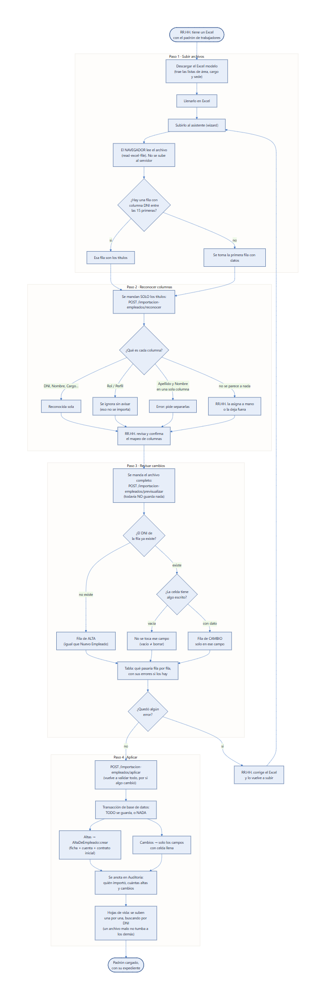
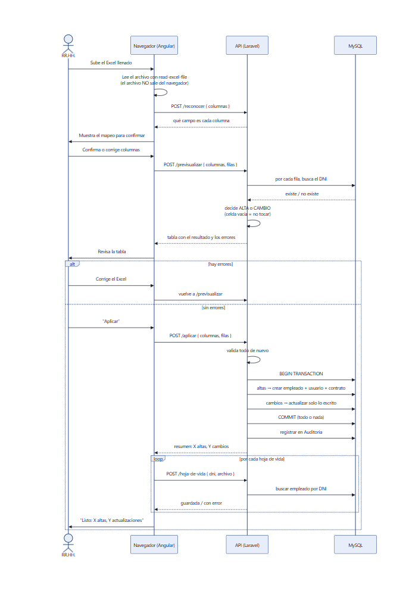

# Tablero Trello — sprint por sprint

Todo listo para copiar. Complementa a [SPRINTS-Y-EVIDENCIAS.md](SPRINTS-Y-EVIDENCIAS.md)
(que trae los commits reales de cada sprint).

---

## 0. Cómo armar el tablero (10 minutos)

**Listas** (de izquierda a derecha):

`Product Backlog` · `Sprint 0` · `Sprint 1` · … · `Sprint 10` · `Impedimentos`

Una lista por sprint hace que cada sprint sea su propia "carpeta de evidencias".
Al cerrar un sprint, muevan la lista a la derecha o archívenla.

**Etiquetas** (una por dimensión de la rúbrica de la UPeU):

| Color | Etiqueta |
|---|---|
| Azul | Ingeniería de Software |
| Verde | Base de datos |
| Rojo | Seguridad |
| Morado | Gestión de proyectos |
| Naranja | UX/UI |
| Gris | Documentación |
| Amarillo | Pruebas |

**Campos de cada tarjeta:** título · etiqueta · fecha de entrega · miembro ·
descripción · checklist · adjuntos (las capturas).

**Definición de "Hecho"** (péguenla como descripción de la lista `Sprint 0` y
úsenla siempre):

```
Una tarjeta está HECHA cuando:
1. Funciona en el sistema (se probó a mano).
2. Tiene su prueba automática, si es lógica de negocio.
3. Está commiteada en GitHub con un mensaje claro.
4. Tiene al menos una captura adjunta como evidencia.
5. El Product Owner (RR.HH.) la vio en la revisión del sprint.
```

**Cómo pegar rápido:** en Trello, dentro de una lista, "Añadir tarjeta" → pegar
varias líneas → crea **una tarjeta por línea**. Para el checklist: dentro de la
tarjeta, "Checklist" → "Añadir" → pegar varias líneas → **un ítem por línea**.

**Cómo tomar las capturas:** `Win + Shift + S`, se pega en Trello con `Ctrl + V`
sobre la tarjeta (queda como adjunto). Pongan siempre la **fecha visible** (la
barra de tareas de Windows sirve).

---

## Ciclo fijo de cada sprint (cuatro tarjetas que se repiten)

Créenlas en **cada** lista de sprint. Son la evidencia de Scrum (rúbrica ítems 15, 20 y 38).

**Tarjeta "Planificación del sprint"** · etiqueta Gestión de proyectos
```
Objetivo del sprint definido con el Product Owner
Historias elegidas del Product Backlog
Historias estimadas (puntos o horas)
Fechas de inicio y fin acordadas
```
📎 *Captura del tablero con las historias del sprint ya en su lista.*

**Tarjeta "Reunión diaria (registro)"**
```
Qué hice ayer
Qué haré hoy
Qué me impide avanzar
```
📎 *Comentarios de la tarjeta: uno breve por día trabajado.*

**Tarjeta "Revisión del sprint"**
```
Demostración del incremento al Product Owner
Feedback anotado
Historias aceptadas / rechazadas
```
📎 *Foto o captura de la reunión (o del acta), y una captura de la pantalla demostrada.*

**Tarjeta "Retrospectiva"**
```
Qué salió bien
Qué mejorar
Una acción concreta para el siguiente sprint
```
📎 *Captura de las tres listas escritas.*

---

## Sprint 0 — Levantamiento y preparación
**Objetivo:** entender el proceso real del colegio y dejar listo el ambiente.

### 1. Levantamiento del proceso de planilla · *Gestión de proyectos*
**Descripción:** entrevistar a RR.HH., revisar los Excel que usan (renta de 5ta, PLAME) y anotar cómo calculan.
```
Entrevista con RR.HH. sobre el proceso actual
Revisar el Excel de planilla y el de renta de 5ta
Revisar las 13 hojas del PLAME
Listar los problemas del proceso manual
Priorizar el Product Backlog con el Product Owner
```
📎 **Evidencia:** foto o acta de la entrevista · captura de los Excel abiertos (sin datos personales) · captura del Product Backlog priorizado.

### 2. Ambiente de desarrollo · *Ingeniería de Software*
**Descripción:** proyecto Laravel + Angular funcionando en local.
```
Crear repositorio en GitHub
Crear proyecto Laravel (API) y Angular (interfaz)
Configurar la base de datos MySQL
Definir ramas de trabajo
```
📎 **Evidencia:** captura de GitHub con el primer commit (2026-05-03) · captura de `php artisan serve` y `ng serve` corriendo.

### 3. Migraciones iniciales · *Base de datos*
```
Diseñar tablas de empleados, vacaciones, planilla y documentos
Escribir las migraciones
Ejecutar php artisan migrate
```
📎 **Evidencia:** captura de la carpeta `database/migrations` · captura de las tablas en MySQL Workbench.

### 4. Plan de prácticas · *Documentación*
```
Redactar objetivos, alcance y metodología
Definir los 10 sprints
Definir riesgos y presupuesto
```
📎 **Evidencia:** captura de `docs/PLAN-DEL-PROYECTO-CATA-RECIBO.md`.

---

## Sprint 1 — Personal y contratos
**Objetivo:** ficha completa del trabajador y padrón cargado.

### 1. CRUD de empleados · *Ingeniería de Software*
```
Formulario con datos personales, cargo, área y sede
Validar DNI de 8 dígitos y CUSPP
Validar fecha de ingreso no futura
Lista con filtros y búsqueda
Alta, edición y baja (soft delete)
```
📎 **Evidencia:** captura de la lista de Empleados · captura del formulario · captura de un error de validación (DNI inválido).

### 2. Contratos · *Ingeniería de Software*
```
Modelar tipos de contrato (indeterminado, plazo fijo, suplencia, prácticas)
Pantalla de contratos por trabajador
Contrato vigente manda sobre la ficha
```
📎 **Evidencia:** captura del módulo Contratos.

### 3. Importar el padrón desde Excel (ETL) · *Base de datos*
**Descripción:** cargar todos los trabajadores desde el Excel del colegio, con previsualización antes de guardar. Son 4 pasos, y así es como funciona de verdad (revisado en el código):

1. **Subir archivos** — el navegador lee el Excel él mismo (no se sube el archivo entero al servidor); busca la fila de títulos por su columna DNI.
2. **Reconocer columnas** — el backend solo recibe los *títulos* y dice qué campo es cada uno («DNI», «Cargo»…); lo que no reconoce, RR.HH. lo asigna a mano.
3. **Revisar cambios (previsualizar)** — con el archivo completo decide, fila por fila: DNI nuevo → alta completa; DNI existente → solo cambia las celdas con algo escrito (**una celda vacía nunca borra un dato**). Nada se guarda todavía.
4. **Aplicar** — todo se guarda en una sola transacción (todo o nada), queda anotado en Auditoría, y las hojas de vida se suben una por una al final.

```
Descargar el modelo de Excel
Leer el Excel en el navegador y ubicar la fila de títulos
Reconocer las columnas aunque cambien de nombre
Previsualizar altas y cambios por DNI (celda vacía = no tocar)
Corregir el archivo si la previsualización marca errores
Aplicar la importación (transacción: todo o nada)
Subir las hojas de vida, una por una
Probar con un archivo con errores a propósito
```
📎 **Evidencia:**
- Los dos diagramas de abajo (adjuntarlos tal cual a la tarjeta).
- Captura del paso "Reconocer columnas" con alguna columna marcada para corregir a mano.
- Captura de la previsualización, con al menos una alta y un cambio.
- Captura del resultado final ("X altas, Y actualizaciones").
- Captura de un archivo con un DNI de 7 dígitos o una columna repetida, mostrando el error.

**Diagrama del proceso** (`docs/importacion-empleados-flujo.png`):



**Diagrama de secuencia** (`docs/importacion-empleados-secuencia.png`):



### 4. Regla de vacaciones por contrato · *Ingeniería de Software*
```
Solo el contrato indeterminado pide vacaciones
Los demás cobran Vacaciones Truncas
Validar en alta, aprobación y saldo
```
📎 **Evidencia:** captura de la prueba `test_solo_el_contrato_indeterminado_puede_tomar_vacaciones` en verde.

---

## Sprint 2 — Planilla del mes
**Objetivo:** planilla calculada y contrastada con el Excel del colegio.

### 1. Descuento de pensión (ONP y AFP) · *Ingeniería de Software*
```
ONP 13 %
AFP: fondo 10 %, prima 1.37 %, comisión según AFP
Sin sistema de pensiones no se descuenta
Verificar contra el PLAME del colegio
```
📎 **Evidencia:** captura de las pruebas de pensión en verde (`MotorDeCalculoTest`) · captura de una boleta con el desglose.

### 2. Asignación familiar, EsSalud y gratificación · *Ingeniería de Software*
```
Asignación familiar S/ 113 si tiene hijos
EsSalud 9 %
Gratificación de julio y diciembre
Prorrateo por meses trabajados
Bonificación extraordinaria 9 %
```
📎 **Evidencia:** captura de las pruebas de gratificación en verde · captura de la planilla de julio.

### 3. Renta de 5ta categoría · *Ingeniería de Software*
**Descripción:** procedimiento del Art. 40 del reglamento (proyección, tramos 8/14/17/20/30 %, regularización de diciembre).
```
Proyectar el ingreso anual según el mes
Aplicar los tramos sobre 7 UIT
Restar lo ya retenido en meses anteriores
Regularizar en diciembre
Contrastar con el Excel de renta del colegio
```
📎 **Evidencia:** captura de las pruebas de renta en verde · captura del Excel del colegio junto a la boleta del sistema (misma cifra).

### 4. Generar la planilla en lote · *Ingeniería de Software*
```
Corridas de planilla (ej. "Planilla TIC")
Generar todas las boletas del mes de una vez
Aviso de resultado: éxito, parcial o error
Evitar planillas duplicadas
```
📎 **Evidencia:** captura de la pantalla de corridas · captura del aviso de resultado.

### 5. Importar conceptos desde Excel · *Base de datos*
```
Reconocer columnas de conceptos
Previsualizar antes de aplicar
Recordar alias de columnas
Celda vacía = no tocar
Rechazar los conceptos que se calculan solos
```
📎 **Evidencia:** captura de la previsualización.

---

## Sprint 3 — Boletas
**Objetivo:** boletas emitidas y avisadas al trabajador.

```
Boleta en PDF con el diseño del colegio
Emisión individual desde RR.HH.
Emisión masiva
Correo de aviso al trabajador (por cola)
Que el PDF diga la misma cifra que la planilla
```
### Tarjetas
1. **Boleta en PDF** · captura del PDF abierto.
2. **Emisión masiva** · captura de la pantalla de emisión y del aviso de resultado.
3. **Correo de aviso** · captura del correo recibido (Mailtrap).
4. **Boleta = planilla** · captura de la planilla y del PDF con el mismo neto.

---

## Sprint 4 — Autoservicio y firma
**Objetivo:** el trabajador ve, firma y descarga su boleta.

### 1. Mis boletas · *UX/UI*
```
Lista de mis boletas por mes
Ver el PDF sin descargar
Rastro: avisada, vista, descargada, firmada
```
📎 captura de "Mis boletas".

### 2. Firma dibujada en pantalla · *Seguridad*
```
Lienzo para dibujar la firma
Confirmar con contraseña
Guardar la firma del trabajador
Mostrar la firma ya guardada
Primero firmar, después descargar
```
📎 captura del lienzo de firma · captura de la boleta firmada.

### 3. Límite de intentos al firmar · *Seguridad*
```
Máximo 3 intentos con contraseña incorrecta
Cerrar la sesión al superarlos
```
📎 captura del mensaje de bloqueo.

### 4. Cambio de contraseña y términos de uso · *Seguridad*
```
Forzar cambio de la contraseña inicial (423)
Forzar aceptar los términos (428)
Recuperar contraseña por correo
```
📎 captura de la pantalla de cambio de clave · captura de los términos.

---

## Sprint 5 — Expediente digital
**Objetivo:** un expediente por trabajador con sus documentos.

```
Documentos por trabajador: hoja de vida, contratos, boletas
El trabajador sube su hoja de vida
Boletas y contratos anteriores en lote
Leer el DNI dentro del PDF para asignarlo
Trabajadores cesados por Excel
```
### Tarjetas
1. **Expediente del trabajador** · captura de la vista de expediente.
2. **Subida en lote de documentos anteriores** · captura del asistente (wizard) con el DNI reconocido.
3. **Cesados por Excel** · captura del resultado.
4. **Pruebas de lectura de PDFs** · captura de `identificar-documento.spec` en verde (13 pruebas).

---

## Sprint 6 — Seguridad y auditoría
**Objetivo:** saber quién entra, qué ve y qué cambió.

### 1. Roles y permisos por módulo · *Seguridad*
```
Roles: admin, rrhh, empleado
Un trabajador no entra a las pantallas de RR.HH. (403)
El trabajador solo ve su propia planilla
Menú según rol
```
📎 captura de `RolesYAccesosTest` en verde.

### 2. Login seguro (OWASP) · *Seguridad*
```
Mismo mensaje para "no existe", "clave mala" y "cuenta inactiva"
Gastar el mismo tiempo en los tres casos
Límite de intentos (429)
Registro público cerrado
Sesión que caduca por inactividad
```
📎 captura de `AutenticacionTest` en verde · captura del mensaje único en la pantalla de login.

### 3. Auditoría de la aplicación · *Base de datos*
```
Anotar altas, cambios y bajas con antes y después
Nunca guardar contraseñas en claro
Pantalla de solo lectura para Admin
```
📎 captura de la pantalla de Auditoría · captura de las pruebas de auditoría en verde.

### 4. Trigger de historial de planilla · *Base de datos*
**Descripción:** la base guarda el total anterior y el nuevo aunque el cambio no pase por Laravel.
```
Crear la tabla planilla_historial
Crear el trigger AFTER UPDATE en planilla
Probar un UPDATE directo a la base
Ejecutar la migración en MySQL
```
📎 captura de `HistorialDePlanillaTest` en verde · captura en MySQL Workbench de `SELECT * FROM planilla_historial`.

### 5. Procedimiento almacenado · *Base de datos*
```
Crear sp_resumen_planilla(anio, mes)
Ejecutar CALL sp_resumen_planilla(2026, 3)
```
📎 captura del resultado del `CALL` en Workbench. **(Falta probarlo en MySQL antes de mostrarlo.)**

---

## Sprint 7 — Reportes y panel de control
**Objetivo:** indicadores del mes y exportación a Excel.

```
Panel con cifras reales de la base (empleados, nómina, firmas)
Gráficos: pensiones y estado de firma de las boletas
Exportar el panel a Excel
Exportar tablas con los filtros aplicados
Rendimiento: índices y una sola petición
```
### Tarjetas
1. **Panel de control** · captura del dashboard.
2. **Gráficos** · captura de los gráficos.
3. **Exportaciones** · captura de un Excel exportado.
4. **Rendimiento** · captura de la migración de índices.

---

## Sprint 8 — Despliegue
**Objetivo:** el sistema en producción con respaldo.

```
Dockerizar: base, app, web, cola, reloj
Un solo comando: docker compose up -d --build
Sembrar los catálogos desde un .sql versionado
Avisar en vez de reventar si faltan tablas
Respaldo de la base
Documentar en DESPLIEGUE.md e INSTALACION.md
```
📎 **Evidencia:** captura de `docker compose ps` con los 5 servicios · captura de `compose.yaml` · captura del respaldo generado.

---

## Sprint 9 — Capacitación y estabilización
**Objetivo:** el personal sabe usarlo y no hay incidencias abiertas.

```
Guía del primer día dentro del sistema
Sesión de capacitación a RR.HH.
Sesión de capacitación a trabajadores
Manual de usuario
Colección Postman en verde (564 de 564)
Cerrar incidencias reportadas
```
📎 **Evidencia:** foto o lista de asistencia de la capacitación · captura de la guía del primer día · **captura de Postman con 564/564**.

---

## Sprint 10 — Cierre
**Objetivo:** documentación completa y entrega formal.

### 1. Pruebas automáticas del backend · *Pruebas*
```
Ejecutar: cd CR-Backend && php vendor/bin/phpunit
Verificar 60 pruebas en verde
Guardar la salida
```
📎 **captura de la terminal con `passed: 60`.**

### 2. Pruebas automáticas del frontend · *Pruebas*
```
Ejecutar: cd CR-Fronend && npm run test:ci
Verificar 86 pruebas en verde
Guardar la salida
```
📎 **captura de la terminal con `86 SUCCESS`.**

### 3. Modelo de datos · *Base de datos*
```
Modelo entidad-relación generado desde las migraciones
Diagramas por grupo (personal, planilla, documentos y seguridad)
Script SQL para Workbench
```
📎 captura de `docs/modelo-datos.png`.

### 4. Diagramas UML y arquitectura · *Documentación*
```
Arquitectura en capas
Casos de uso
Diagrama de clases
Secuencia: login
Secuencia: generar planilla
Estados de la boleta
Despliegue
```
📎 captura de `docs/ARQUITECTURA-Y-UML.md` abierto en GitHub (renderiza los diagramas).

### 5. Calidad ISO 25010 · *Documentación*
📎 captura de `docs/CALIDAD-Y-PRUEBAS.md`.

### 6. Integración continua · *Pruebas*
```
Subir el workflow .github/workflows/pruebas.yml
Verificar que pasa en la pestaña Actions de GitHub
```
📎 captura de Actions en verde. **(No probado todavía: ajustar si falla.)**

### 7. Informe y acta de conformidad · *Documentación*
```
Informe final de prácticas
Plan de firma digital con DNIe
Acta de conformidad firmada por el supervisor
```
📎 foto del acta firmada.

---

## Lista de capturas — para no olvidar ninguna

| # | Captura | Sprint |
|---|---|---|
| 1 | Primer commit en GitHub | 0 |
| 2 | Lista de Empleados y formulario | 1 |
| 3 | Previsualización de la importación | 1 |
| 4 | Pruebas del motor de planilla en verde | 2 |
| 5 | Excel del colegio junto a la boleta del sistema | 2 |
| 6 | PDF de la boleta | 3 |
| 7 | Lienzo de firma y boleta firmada | 4 |
| 8 | Expediente y carga en lote | 5 |
| 9 | Pruebas de acceso y login en verde | 6 |
| 10 | Auditoría, trigger y `CALL sp_resumen_planilla` | 6 |
| 11 | Panel de control | 7 |
| 12 | `docker compose ps` | 8 |
| 13 | Postman 564/564 | 9 |
| 14 | phpunit 60 · karma 86 | 10 |
| 15 | Diagramas ER y UML | 10 |
| 16 | GitHub Actions en verde | 10 |
